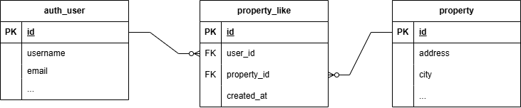

# Habi - API de Consulta de Inmuebles (Microservicio)

## Introducción

Este proyecto consiste en el desarrollo de un microservicio REST API para Habi. El propósito principal de esta API es permitir a los usuarios externos consultar los inmuebles disponibles para la venta almacenados en la base de datos. Los usuarios podrán ver tanto inmuebles vendidos como disponibles, y aplicar diversos filtros para refinar sus búsquedas, como año de construcción, ciudad y estado del inmueble. Adicionalmente, aunque no se implementará en este primer microservicio, se contempla la funcionalidad de "me gusta" para los inmuebles.

Este primer microservicio se enfocará en la **consulta de inmuebles**.

## Tecnologías Utilizadas

Para el desarrollo de este microservicio, se emplearán las siguientes tecnologías y estándares:

* **Lenguaje de Programación:** Python 3.13.3
* **Base de Datos:** MySQL. La interacción se realizará mediante consultas SQL directas utilizando la librería `mysql-connector-python`, sin el uso de ORMs, según los requisitos de la prueba.
* **Servidor HTTP:** Se utilizará el módulo `http.server` de la biblioteca estándar de Python para construir el servidor API, cumpliendo con la restricción de no usar frameworks externos.
* **Pruebas Unitarias:** Se empleará el módulo `unittest` de la biblioteca estándar de Python. Se buscará seguir principios de TDD (Test-Driven Development) como punto extra.
* **Control de Versiones:** Git.
* **Guía de Estilos:** Se seguirá la guía de estilos PEP8 para Python para asegurar un código limpio y legible.
* **Formato de Datos:** JSON para el intercambio de datos con el cliente (ej. filtros de entrada, respuestas de la API).

## Estructura del Proyecto

El proyecto se organizará con la siguiente estructura de directorios y archivos, buscando la claridad, mantenibilidad y separación de responsabilidades:

```
habi-ms-property-api/
├── app/                       # Código fuente de la aplicación
│   ├── init.py                # Inicializador del paquete 'app'
│   ├── db_config.py           # Configuración de la conexión a la base de datos
│   ├── database_manager.py    # Lógica de acceso y manipulación de datos (SQL)
│   ├── property_service.py    # Lógica de negocio para la consulta de inmuebles
│   ├── request_handler.py     # Manejo de solicitudes HTTP y formato de respuestas
│   └── models.py              # Clases para la representación de datos internos (ej. Inmueble)
├── tests/                     # Pruebas unitarias
│   ├── init.py                # Inicializador del paquete 'tests'
│   └── (archivos de prueba, ej: test_property_service.py)
├── server.py                  # Punto de entrada para iniciar el servidor HTTP
├── README.md                  # Este archivo: documentación del proyecto
├── requirements.txt           # Dependencias de Python del proyecto
├── .env                       # Variables de entorno
└── .gitignore                 # Archivos y directorios ignorados por Git
```

**Justificación de la Estructura:**
Esta estructura, aunque no utiliza un framework, se inspira en principios de diseño por capas para separar las responsabilidades:
* `server.py`: Inicia y configura el servidor.
* `app/request_handler.py`: Actúa como la capa de presentación/controlador, interpretando las peticiones HTTP y delegando a la capa de servicio.
* `app/property_service.py`: Contiene la lógica de negocio (aplicación de filtros, reglas de negocio).
* `app/database_manager.py`: Es la capa de acceso a datos, aislando las consultas SQL.
* `app/models.py`: Define cómo se estructuran los datos dentro de la aplicación.
* `app/db_config.py`: Externaliza la configuración de la base de datos.

Esta separación busca facilitar la mantenibilidad, la legibilidad y la capacidad de realizar pruebas unitarias de forma aislada. 

## Abordaje del Desarrollo (Servicio de Consulta)

El servicio de consulta de inmuebles se desarrollará como una API REST y cumplirá con los siguientes requisitos funcionales:

1.  **Consulta de Inmuebles por Estado:** Permitirá consultar inmuebles con estados "pre_venta", "en_venta" y "vendido". El estado actual de un inmueble se determinará por el último registro en la tabla `status_history` para dicho inmueble.
2.  **Filtros:** Los usuarios podrán filtrar los inmuebles por:
    * Año de construcción
    * Ciudad
    * Estado (del inmueble, ej: "en_venta")
    Se permitirá la aplicación de múltiples filtros en una misma consulta.
3.  **Información a Devolver:** La API retornará la siguiente información para cada inmueble: Dirección, Ciudad, Estado (entidad federativa), Precio de venta y Descripción.
4.  **JSON de Entrada para Filtros:** Se definirá y documentará un archivo JSON ejemplo que represente la estructura esperada para los filtros enviados por el cliente.
5.  **Calidad del Código:** Se priorizará un código fácil de mantener, leer y que sea autodocumentado.
6.  **Pruebas Unitarias:** Se desarrollarán pruebas unitarias para validar la funcionalidad del código.

No se realizarán modificaciones a los registros existentes en la base de datos, pero se podrán agregar nuevos registros si es necesario para las pruebas. Se prestará atención al manejo de posibles inconsistencias en los datos y excepciones.

## API: Consulta de Inmuebles

### Endpoint de Consulta

`GET /properties`

Este endpoint permite consultar la lista de inmuebles. Retorna una lista de inmuebles que pueden ser filtrados según los parámetros especificados.

### Aplicación de Filtros

Los filtros se aplican como parámetros de consulta (query parameters) en la URL del endpoint `/properties`. Se pueden combinar múltiples filtros en una misma solicitud. Si no se proporciona ningún filtro, se devolverán todos los inmuebles que cumplan con los estados permitidos ("pre_venta", "en_venta", "vendido").

**Ejemplo de URL con filtros:**

`/properties?city=Bogotá%20D.C.&year=2022&status=en_venta`

### Parámetros de Filtro Soportados

A continuación, se detallan los parámetros de filtro que se pueden utilizar:

1.  **`year`** (Año de construcción)
    * **Descripción:** Filtra los inmuebles por su año de construcción.
    * **Tipo de dato:** Entero (Integer)
    * **Ejemplo:** `year=2021`

2.  **`city`** (Ciudad)
    * **Descripción:** Filtra los inmuebles por la ciudad donde están ubicados.
    * **Tipo de dato:** Cadena de texto (String)
    * **Ejemplo:** `city=Medellín` (El valor debe ser codificado para URL si contiene espacios, ej. `Bogotá%20D.C.`)

3.  **`status`** (Estado del inmueble)
    * **Descripción:** Filtra los inmuebles por su estado actual. Solo se considerarán los inmuebles cuyo último estado registrado coincida con uno de los valores permitidos.
    * **Tipo de dato:** Cadena de texto (String)
    * **Valores permitidos:**
        * `"pre_venta"`
        * `"en_venta"`
        * `"vendido"`
    * **Ejemplo:** `status=pre_venta`

### Estructura de Datos para Filtros (Ejemplo de Referencia)

Para una representación clara de la estructura de datos que el frontend podría manejar para construir estos filtros, se ha creado un archivo JSON de ejemplo. Este archivo ilustra los campos y los tipos de datos esperados para los filtros.

* **Ubicación del archivo de ejemplo:** `examples/filter_input_example.json`
* **Contenido de ejemplo (`examples/filter_input_example.json`):**
    ```json
    {
      "year": 2021,
      "city": "Cartagena",
      "status": "pre_venta"
    }
    ```
    Este JSON es una referencia para entender los datos de los filtros; la API los consumirá como parámetros de consulta en la URL como se describió anteriormente.

## Dudas y Decisiones de Diseño

A continuación, se plantean algunas dudas iniciales y las decisiones tomadas para guiar el desarrollo, enfocándose en la simplicidad, buenas prácticas, estándares actuales, mantenibilidad y escalabilidad dentro de las restricciones de la prueba:

1.  **Duda:** ¿Es la estructura de paquetes propuesta (`app/`, `tests/`, `server.py`, etc.) adecuada y estándar para un proyecto Python sin el uso de frameworks como Django o Flask, especialmente considerando principios de código limpio y mantenibilidad?
    * **Decisión y Justificación:** Sí. La estructura seleccionada, aunque minimalista por la ausencia de un framework, establece una separación clara de responsabilidades.
        * **Simplicidad:** Evita la sobrecarga de un framework no solicitado, enfocándose en Python puro y módulos estándar.
        * **Buenas Prácticas:** Emula una arquitectura por capas (presentación/control en `request_handler.py`, lógica de negocio en `property_service.py`, y acceso a datos en `database_manager.py`), lo cual es una práctica común para organizar el código.
        * **Estándares:** Aunque no hay un estándar único para proyectos sin framework, esta estructura es intuitiva y sigue patrones vistos en muchas aplicaciones Python. El uso de `__init__.py` para definir paquetes es estándar.
        * **Mantenibilidad:** La separación de componentes facilita la comprensión, modificación y prueba de partes individuales del sistema sin afectar otras.
        * **Escalabilidad (Conceptual):** Si bien la escalabilidad de un sistema sin framework tiene límites, esta estructura permite añadir nuevas funcionalidades de forma organizada (ej. nuevos servicios o endpoints) manteniendo el orden.

2.  **Duda:** Al no utilizar un ORM, ¿cómo se gestionarán las consultas SQL y los "modelos" de datos para asegurar un código estándar, seguro (evitando inyección SQL) y mantenible?
    * **Decisión y Justificación:**
        * **Consultas SQL:** Todas las interacciones SQL se centralizarán en el módulo `app/database_manager.py`. Se utilizarán **consultas parametrizadas** (binding de parámetros) que ofrece `mysql-connector-python`. Esta es la práctica estándar y fundamental para prevenir vulnerabilidades de inyección SQL.
        * **"Modelos" de Datos:** Se definirán clases simples en `app/models.py` (por ejemplo, usando `dataclasses` si se permite una mínima extensión de librerías estándar o implementaciones manuales). Estas clases representarán la estructura de los datos (ej. un objeto `Inmueble`) que se manejan entre las capas de servicio y base de datos. Esto mejora la legibilidad y la robustez al trabajar con datos estructurados, sin la complejidad de un ORM completo.
        * **Simplicidad y Estándar:** Este enfoque es más simple que un ORM pero más estructurado que manejar diccionarios o tuplas directamente en toda la aplicación. Es una práctica estándar escribir SQL puro de forma segura.

3.  **Duda:** ¿Cómo se implementará el enrutamiento de las peticiones REST (ej. `/properties`, `/properties?city=X&year=Y`) de forma eficiente y estándar utilizando únicamente el módulo `http.server` de Python?
    * **Decisión y Justificación:** El módulo `http.server` proporciona una base para manejar solicitudes HTTP. La lógica de enrutamiento se implementará en `app/request_handler.py`, que heredará de `http.server.BaseHTTPRequestHandler`.
        * **Análisis de URL:** Se utilizará el atributo `self.path` de la instancia del manejador y el módulo `urllib.parse` (parte de la biblioteca estándar) para analizar la ruta del endpoint y los parámetros de consulta (query string).
        * **Despacho de Solicitudes:** Se implementará una lógica de despacho simple (ej. una serie de `if/elif/else` o un diccionario de mapeo) que asocie las rutas y métodos HTTP (principalmente GET para este servicio) a las funciones correspondientes en `property_service.py`.
        * **Simplicidad y Estándar:** Este método es directo y utiliza herramientas estándar de Python. Para el alcance de esta prueba, con un número limitado de endpoints, es una solución eficiente y clara. Demuestra la comprensión de los fundamentos del protocolo HTTP y el manejo de solicitudes sin abstracciones de frameworks. Para una API con muchos endpoints, un framework con un sistema de enrutamiento más sofisticado sería preferible, pero aquí se cumple el requisito.

## Diseño Conceptual del Servicio "Me Gusta" (Requerimiento 2)

Este segundo requerimiento es de naturaleza conceptual y busca extender el modelo de datos existente para soportar una funcionalidad de "Me Gusta" para los inmuebles. No se espera la implementación del microservicio, solo el diseño del modelo de datos, el SQL para crearlo y la justificación.

### Requisitos de la Funcionalidad "Me Gusta"

* Los usuarios registrados pueden marcar un inmueble con "Me Gusta".
* Este "Me Gusta" debe persistir en la base de datos.
* Se debe mantener un histórico de los "Me Gusta": qué usuario dio "Me Gusta" a qué inmueble y cuándo.
* Este sistema permitirá un ranking interno de los inmuebles más populares.

### Modelo de Datos Propuesto

Para implementar esta funcionalidad, se utilizará la tabla de usuarios existente en la base de datos, `auth_user`, y se propone la creación de una nueva tabla: `property_like`.

#### 1. Tabla `auth_user` (Existente)

* **Observación:** Se ha identificado que la base de datos ya cuenta con una tabla `auth_user`. Esta tabla será la utilizada para la gestión e identificación de los usuarios registrados.
* **Propósito:** Almacena la información de los usuarios. Es fundamental para asociar los "Me Gusta" a un usuario específico.
* **Campos Clave Relevantes para esta funcionalidad:**
    * `id` (INT, PK, AI): Identificador único del usuario. Será la clave foránea en la tabla `property_like`.
    * `username` (VARCHAR, UNIQUE): Nombre de usuario.
    * `email` (VARCHAR): Email del usuario.
    * (La tabla `auth_user` también contiene otros campos como `first_name`, `last_name`, `is_active`, `date_joined`, etc., que pueden ser útiles para la gestión completa de usuarios pero no son directamente referenciados por la tabla `property_like` más allá del `id`).


#### 2. Nueva Tabla `property_like`

* **Propósito:** Esta tabla registra la acción de un usuario dando "Me Gusta" a un inmueble. Actúa como una tabla de cruce (junction table) para la relación muchos-a-muchos entre usuarios e inmuebles.
* **Campos Clave:**
    * `id` (INT, PK, AI): Identificador único del registro de "Me Gusta".
    * `user_id` (INT, FK): Referencia al `id` del usuario de la tabla `auth_user` que dio "Me Gusta".
    * `property_id` (INT, FK): Referencia al `id` del inmueble que recibió el "Me Gusta".
    * `created_at` (DATETIME): Timestamp que registra el momento exacto en que se dio el "Me Gusta". Este campo es crucial para el requisito de "histórico".
* **Consideraciones de Diseño:**
    * **Unicidad:** Se añade una restricción `UNIQUE` en el par `(user_id, property_id)`. Esto asegura que un usuario solo pueda tener un "Me Gusta" activo para un inmueble específico simultáneamente. Si un usuario "quita el Me Gusta" (lo que probablemente implicaría borrar el registro de `property_like`) y luego vuelve a marcar "Me Gusta", se crearía un nuevo registro con un nuevo `created_at`.
    * **Histórico:** El "histórico de 'me gusta' de cada usuario y a cuáles inmuebles" se puede consultar seleccionando todos los registros de `property_like` para un `user_id` específico. La fecha `created_at` indica cuándo se estableció cada "Me Gusta".
    * **Ranking:** El ranking de inmuebles se puede obtener contando el número de registros en `property_like` agrupados por `property_id`.
    * **Relaciones (Constraints FK):** Se definen llaves foráneas hacia `auth_user.id` y `property.id` con la opción `ON DELETE CASCADE`. Esto significa que si un usuario o un inmueble es eliminado del sistema, sus "Me Gusta" asociados también se eliminarán automáticamente, manteniendo la integridad de los datos.

### Diagrama ERD Simplificado

Se muestra la relación entre la tabla existente `auth_user`, la tabla existente `property` y la nueva tabla `property_like`:




### Código SQL (Solo para la Nueva Tabla `property_like`)

Dado que la tabla `auth_user` ya existe, solo se proporciona el SQL para crear la nueva tabla `property_like`, asegurándose de que la clave foránea `user_id` referencie correctamente a `auth_user.id`.

```sql
-- -----------------------------------------------------
-- Table `habi_db`.`property_like`
-- (Asegurándose que la tabla `auth_user` y `property` ya existen)
-- -----------------------------------------------------
CREATE TABLE IF NOT EXISTS `habi_db`.`property_like` (
  `id` INT NOT NULL AUTO_INCREMENT,
  `user_id` INT NOT NULL COMMENT 'ID del usuario (de la tabla auth_user) que dio "Me Gusta".',
  `property_id` INT NOT NULL COMMENT 'ID del inmueble que recibió el "Me Gusta".',
  `created_at` DATETIME NOT NULL DEFAULT CURRENT_TIMESTAMP COMMENT 'Fecha y hora en que se registró el "Me Gusta".',
  PRIMARY KEY (`id`),
  INDEX `fk_property_like_auth_user_idx` (`user_id` ASC) VISIBLE,
  INDEX `fk_property_like_property_idx` (`property_id` ASC) VISIBLE,
  -- Restricción para asegurar que un usuario solo pueda tener un "Me Gusta" activo por inmueble.
  UNIQUE INDEX `uk_auth_user_property_like` (`user_id` ASC, `property_id` ASC) VISIBLE,
  CONSTRAINT `fk_property_like_auth_user`
    FOREIGN KEY (`user_id`)
    REFERENCES `habi_db`.`auth_user` (`id`)
    ON DELETE CASCADE
    ON UPDATE CASCADE,
  CONSTRAINT `fk_property_like_property`
    FOREIGN KEY (`property_id`)
    REFERENCES `habi_db`.`property` (`id`)
    ON DELETE CASCADE
    ON UPDATE CASCADE)
ENGINE = InnoDB
DEFAULT CHARACTER SET = latin1
COMMENT = 'Registra los "Me Gusta" que los usuarios (de auth_user) dan a los inmuebles.';